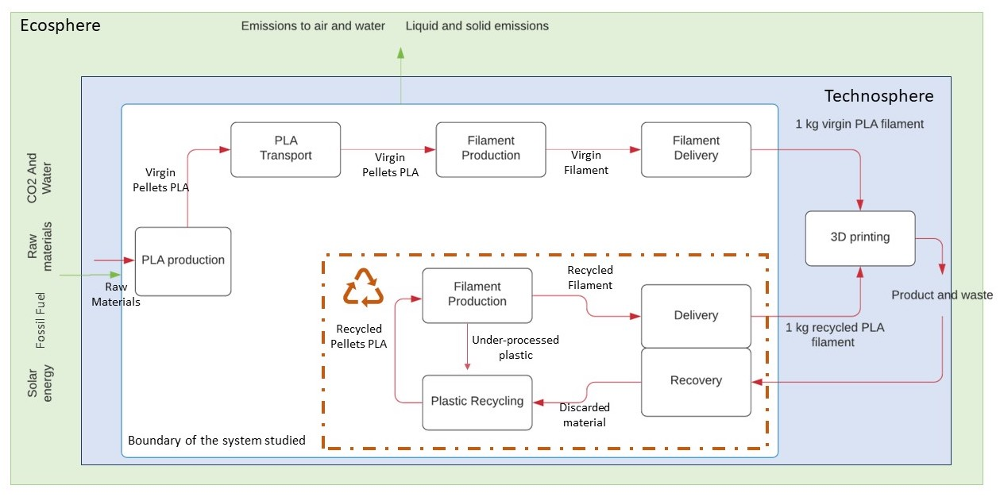
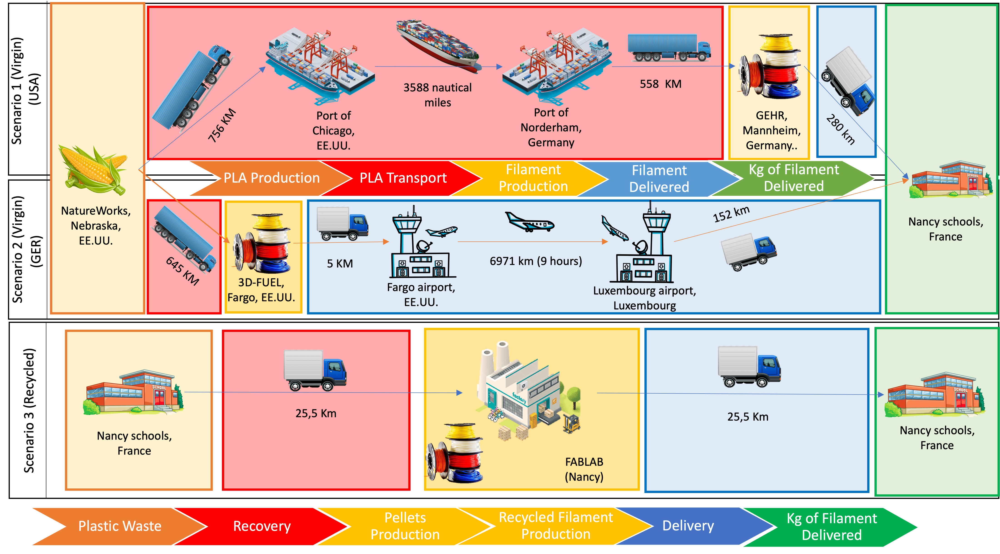
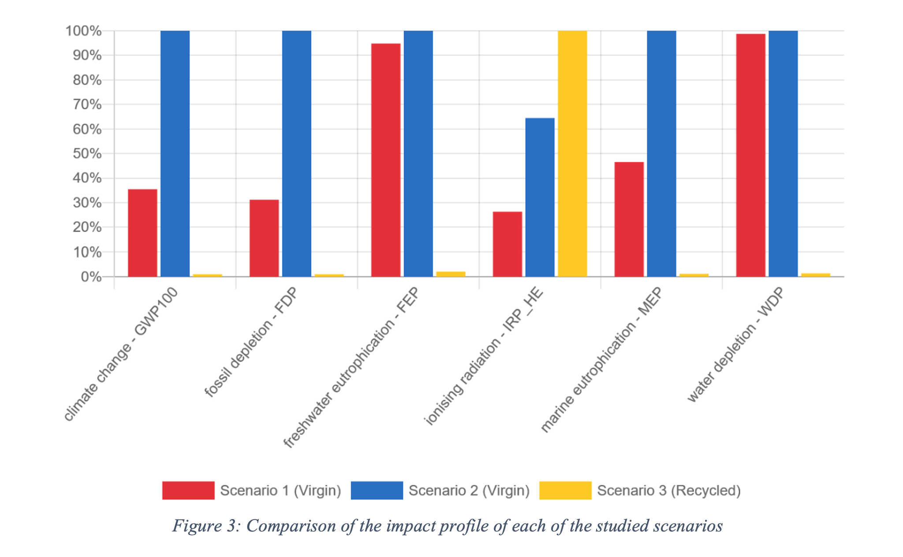
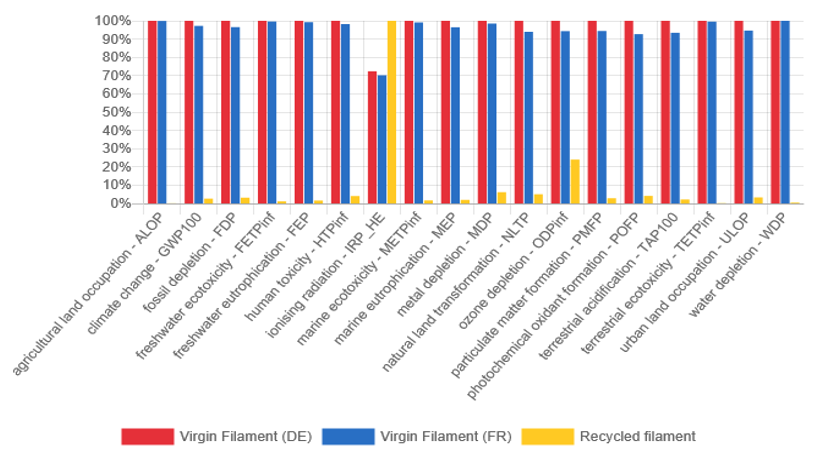
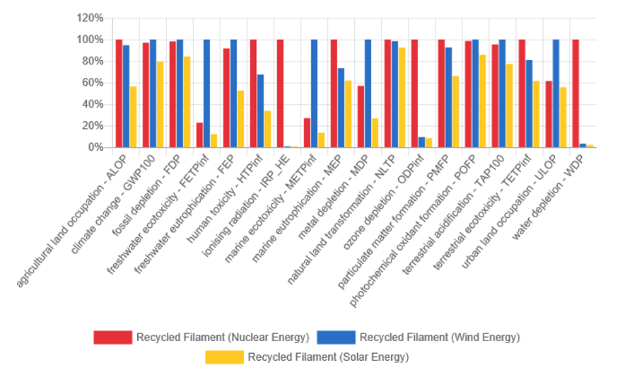

```{r setup, include=FALSE, echo=FALSE}

library(kableExtra)
library(tidyverse)
library(readxl)

knitr::opts_chunk$set(echo = FALSE, fig.retina = 3, 
                      message = FALSE, warning = FALSE,
                      out.width = '90%',
                      fig.align = 'center',
                      fig.pos = "H",
                      out.extra = "")
options(knitr.kable.NA = '')


```

# Introduction
<!-- Plastics topic -->
\linenumbers
Since the early 20th century, the invention of plastic, or synthetic organic polymers, has changed the landscape of various industrial sectors.
Production increased at a compound annual growth rate of 8.4%, rising from $2Mt$ in 1950 to $368Mt$ in 2019 [@Geyer2017].
This versatile material stands out thanks to its easy processing and handling in shape, color, texture, thermal and barrier properties, and its mechanical and chemical resistance  [@Andrady2009; @Thompson2009a ]. 
In consequence, 39.6% of the demand comes from the packaging industry, followed by the construction and automotive industries with 20.4% and 9.6% of the production share respectively  [@PlascticEurope2020].
<!-- Plastic issues -->
Unfortunately, the main problem is associated with multiple environmental damages throughout its life cycle. 
Terrestrial, aquatic, and atmospheric ecosystems are not exempt from the externalities of this innovation, which represent a major issue  [@Kumar2021].
Micro-, meso-, and nano-plastic pollution contribute to the detriment of ecosystem services such as the ability to sequester carbon [@wang2022a], soil productivity [@zhang2022b], and eutrophication [@vuori2022].  
Indeed, plastic pollution in aquatic ecosystems such as standing waters can act as a vector of toxic chemicals that affect biogeochemical cycles. 
<!-- Exemples de Marine -->
In 2010, @jambeck2015 estimated that between 1.75–4.62% mismanaged plastic wasted  reached the oceans equivalent to 4.8 to 12.7 million MT in 192 coastal countries.
 <!-- which is equivalent to an entire garbage truck full of plastic being dumped into the sea every minute.  -->
<!-- Statistics marine -->
A total of 150 million tons of plastic has been dumped into the sea to date  [@pintodacosta2020].
The presence of these solid plastic wastes has become a threat to marine ecosystems  [@shi2022]. 
<!-- Conclusion -->
Additionally, the transfer of plastic into the food chain is a clear danger to animals, and certainly to humans as well.
Therefore, reducing the production of plastics is of great importance in the long term.


   <!-- Plastic waste rates -->
<!-- The main reason relies on the single-use product (50% of plastic produced) (Feuille, 2018).  -->
<!-- Considering the plastic disposed, only 9% of the plastic that has been produced since 1950 has been recycled, the rest has been incinerated, found in landfills or thrown into the sea (Geyer et al., 2017; João et al., 2020)  -->

<!-- Complexity of plastics -->
Adequate use and disposal of plastics is a wicked problem, characterized by high complexity and multifaceted feedback loops.
A systemic view of the entire plastics value chain is needed, including petrochemical companies  [@Iles2013; @DeVargasMores2018], converters [@Paletta2019], brand owners or manufacturers [@Gong2020; @Ma2020], retailers and consumers [@Confente2020; @Friedrich2020; @Filho2021], and recycling operators [@Huysveld2019; @Pazienza2020], as well as the influences of policy-makers on wider economic and societal changes  [@Paletta2019].
   <!-- Circular Economy -->
The European Union (EU) intends to develop a circular economy (CE) based on a production and consumption model with key activities such as “sharing,” “reducing,” “reusing,” “repairing,” “renewing,” and “recycling” the existing materials and products as many times as possible, in order to create added value by extending the life cycle of products [@EC2018; @matthews2020]. 
   <!-- Critics to Circular Economy -->
Several criticisms have been raised, given the thermodynamic constraints based on biodiversity and thermodynamics, arguments for a fully circular economy  [@corvellec2021; @Giampietro2020].
   <!-- Green Deal -->
 Nevertheless, as part of the European Green Pact presented on March 20, 2020, there are plans to establish an action plan involving the circular economy, mainly promoting the development of sustainable products, reducing waste, and empowering citizens as key players  [@EC2018]. 
   <!-- French CE -->
Considering the French context, a target was established that by 2025 all plastic waste should be recycled, but currently recycling statistics in 
France are only reaching levels close to 25%. 
   <!-- Historical -->
Despite these ambitious objectives, plastics recycling has historically been an expensive process due to the inherent separate collection, transportation, processing, and remanufacturing [@Hopewell2009; @Singh2017b]. 
The economies of scale have been leveraged to reduce these costs with centralized and global recycling chains [@Anzalone2013; @Kreiger2013]. 
   <!-- Problems of the Plastic Recycling -->
 Nevertheless, in order to carry out this recycling system, multiple steps need to be accomplished that integrate the sorting phase, long-distance transport, waste treatment, and remanufacturing. The high costs of these processes and the low selling price (mainly due to the dependence of the recycled plastic price on the petroleum and virgin prices) seldom generate benefits and often require costly public subsidies [@hamilton2019]. 
      <!-- Ecosystems affectation -->
In addition, these centralized plastic manufacturing and recycling lines lead to soil, water, and air pollution  [@Arena2003; @carlssonreich2005]. 
In addition to the current problems in the plastic recycling network, we can highlight that supply chains in general are under increasing pressure from various stakeholders to make decisions from a sustainable perspective; in other words, based on economic, environmental, and social objectives [@hassini2012].


<!-- Additive Manufacturing & Distribute Manufacturing  -->
Additive manufacturing technology (also known as 3D printing) enables the potential of distributed manufacturing (DM) for products of high added value [@BonninRoca2019; @Woern2017; @Petersen2017a]. 
   <!-- Distributed Recycling -->
Nowadays, the accessibility of freely available designs has increased significantly, together with the development of open-source technologies and the supply of raw materials (virgin and recycled filaments) for 3D printing [@Hunt2015]. 
   <!-- Distribute Manufacturing -->
Distributed manufacturing is defined as the decentralization of production through the installation of multiple production factories with similar technology distributed geographically  [@BonninRoca2019]. 
 It is characterized by local production that thrives on the synergy of the emerging capabilities of digital manufacturing, information, and communication technologies, and the peer-to-peer production approach  [@Kostakis2013b; @Kostakis2018; @Pavlo2018]. 
Indeed, DM offers the possibility to decentralize production structures, the flexibility to reflect local customer needs, lower logistics costs, shorter lead times, and lower environmental impacts  [@Woern2017; @Petersen2017a].
<!-- Distributed Recycling -->
Based on the DM paradigm, a new possibility of plastic recycling supported by additive manufacturing, called distributed recycling by additive manufacturing (DRAM), has emerged in the literature  [@CruzSanchez2020; @Hart2018]. 
Promoted by the development of 3D printing in an open-source context, DRAM is proposed to provide recycled plastic feedstock to the various 3D printers in a DM context. 
   <!-- FFF / FGF -->
This recycled plastic can take the form of a filament, and recent works have dealt with the validation of a granular form  [@JustinoNetto2021; @Arthur2020].
The 3D printing feedstock is then obtained via plastic recycling on a local scale using open-source machines such as shredders and extruders  [@Zhong2018]. 
   
<!-- DRAM -->
The main feature of DRAM is the reduction of the impact in the collection phase, favoring shorter and simpler supply chains [@Despeisse2016; @Garmulewicz2018].
   <!-- Technical -->
Several works have focused on the validation of the DRAM approach from a technical [@Mohammed2022; @lopez2022], economic, and environmental perspective [@Wu2021a;  @canado2022]. 
@CruzSanchez2020 conducted a systematic literature review to examine the level of development of the different DRAM stages from a technical perspective. 
Their results show that significant progress has been made in the stages of compounding, feedstock, printing and quality assessment. 
However, they also show that little work has been done for the preparation and recovery stages in spite of this.
   <!-- Logistical -->
In another work, @Santander2020 proposed an initial model to study the economic and environmental feasibility of DRAM from a logistical point of view. Their results have shown the feasibility of the system in economic terms and in the reduction of CO2 emissions when implementing the system. 
   <!-- DRAM Environmental -->
From an environmental point of view, the DRAM and DM approaches have been evaluated mainly using the Life Cycle Assessment (LCA) approach.

<!-- Arguing for LCA as conception tool in early design phases -->
LCA is one of the most widely used environmental impact assessment methodologies. LCA corresponds to an ISO 14040 certified methodology, which has even been used for environmental regulations in different parts of the world. 
In the context of DM/DRAM-related research, LCA has been applied in various ways.
   <!-- Joshua 2013 -->
For example, @Kreiger2013 conducted a life cycle analysis, in terms of energy consumed and emissions involved, to compare centralized manufacturing and distributed manufacturing using RepRaps (3D printers) for the distributed production of goods. 
The results showed that the use of Poly Lactic Acid (PLA) in a distributed manufacturing context reduces energy demand and system emissions, which can be greatly diminished if a solar photovoltaic (PV) array is used. 
   <!-- Joshua 2014 -->
Later, @Kreiger2014 explored the environmental benefit of distributed recycling using open-source extruders (RecycleBots), which have been used to obtain 3D printing filament from post-consumer goods. 
Focusing on the use of High Density Poly-Ethylene (HDPE) for the material, they performed an LCA of energy consumption and CO2 emissions to compare distributed recycling to standard centralized recycling. 
Their results showed that distributed recycling of HDPE uses less energy than the best-case scenario investigated for centralized recycling, and it can achieve savings of over 80%.
   <!-- Kerdlap et al. (2021) -->
@Kerdlap2021, through a simulation approach, quantified the plastic life-cycle environmental impact of small-scale sorting and recycling systems in comparison to traditional large-scale centralized systems in Singapore, with the aim of determining the conditions under which distributed recycling can be environmentally beneficial. 
Their results showed that the environmental impacts in terms of climate change, water depletion and terrestrial ecotoxicity were higher compared to the centralized systems. 
Their results showed that the environmental impacts in terms of climate change, water depletion, and terrestrial ecotoxicity were higher compared to the centralized systems. However, these results are mainly related to the means of transport considered for each system (commercial van for distributed recycling and large trucks for centralized recycling), since the use of large trucks decreases the total impact.


In conclusion, even though different studies have been conducted aiming to validate the distributed recycling approach from a technical, economic, and environmental perspective, only the work of  @Kreiger2014 is focused on the environmental assessment of distributed recycling for 3D printing purposes. 
<!-- Research gap -->
However, their research is limited to the consideration of energy and $CO_{2}$ emissions as environmental indicators. Therefore, major efforts need to be made in order to evaluate, in a holistic way, the environmental impacts of the global DRAM value chain. 
Thus the contribution of this research lies in the evaluation of environmental impacts from the implementation of distributed recycling via an additive manufacturing approach in a territory. Specifically, an environmental evaluation using life cycle assessment (LCA) is conducted, comparing a distributed plastic recycling system to produce 3D filament with a traditional production system of virgin plastic filament for 3D printing. From this evaluation, the environmental impacts (positives or negatives) of implementing DRAM have been analyzed and discussed.


<!-- Structuration -->
This article is structured as follows. Section \@ref(lf2l) presents the system (case study) evaluated. 
Section \@ref(MM) materials and methods, where life cycle analysis methodology is explained. 
Section \@ref(LCA) presents the life cycle analysis performed. 
Section \@ref(Discussion) presents the discussion of results.
Finally, Section \@ref(conclusions) presents the main conclusions and recommendations for future works.

#	Case study: The Lorraine Fab Living Lab {#lf2l}

In order to achieve the objectives of this research, a case study with the following characteristics was selected:  

1.	Existence of a favorable context to implement a DRAM recycling system. A favorable context is defined as a considerable amount of plastic waste to be treated, as well as initiatives for the widespread use of 3D printing.
2.	Existence of a space dedicated to the recycling of plastic for 3D printing.

Under these considerations, the selected context for this study was the Lorraine Fab living Lab  (LF2L)[^1], an innovation space located in Nancy, France. This university laboratory has been selected mainly for the following reasons: 
<!--  Reasons -->
(1) Innovation spaces such as Fablabs, Maker spaces, design factories among others have proven to be favorable environments for eco-innovations facilitating the implementation of circular economy strategies [@coskun2022]. 
   <!-- Fedoua -->
Previous studies show that these collaborative environments foster sustainable experimental learning, provide methodologies and tools for the co-creation of circular solutions, drive the transition toward sustainable smart cities, foster the creation of new sustainable business models, and facilitate knowledge exchange on circular solutions [@Kasmi2021]. 
   <!-- Fedoua -->
(2) Since 2014, the LF2L has been studying the possibility of recycling, in their installations, PLA for reuse in 3D printing. 
The pilot recycling process present in this center has been developed in the research work of @CruzSanchez2017, and the possibility of implementing this recycling process in the region is being evaluated. 
   <!-- Pavlo -->
(3) An investment program has been launched by the Grand Est region to promote the implementation of Fablabs, and consequently the use of 3D printers, in the schools and high schools of the region [@canope2022]. 
<!-- Reasons -->
The goal of this investment plan is to ensure that all the schools and high schools in the region will be equipped with this technology in the near future. 
This corresponds to the future scenario evaluated in the work of @Santander2020. 
However, in contrast to @Santander2020, in our research work a complete environmental evaluation of the scenario is carried out. 
Consequently, this case study has been selected because of their experience in experimenting with the DRAM strategy, as well as the availability of technical and economic data and the aforementioned scientific publications that provide details on its local implementation.  
For this study, the context described above has been simplified in terms of geographical scale, and the following assumptions are considered.

- Consideration is given to only one type of plastic waste to be recycled. 
Specifically, PLA has been considered. 
This is mainly because PLA is one of the most used plastics in 3D printing [@bikas2016].
For the plastic waste sources, PLA waste from schools and high schools (who have 3D printers) has been considered. 
PLA has been selected as feedstock material due to the fact that (1) in Europe, PLA is considered a "miscellaneous product" [@maga2019] because of its classification as a Bioplastic and because, at least in Europe, there is no defined recycling strategy for these types of plastics so they are usually sent to a landfill or are incinerated; 
and (2) PLA is one of the most widely used plastics in 3D printing.

- The recycling system modeled does not consider the sorting, separation, and cleaning process because the collected material corresponds to non-contaminated waste: for example, discarded 3D printing parts used for prototyping.

- From a geographical point of view, only schools and high schools in the Lorraine region of France have been considered, and the route of recovery and delivery considered is obtained in the work of @Santander2020.

- Each school and high school requires 1 kg of filament per month.

- The 3D printing activities carried out in these establishments have the specific purpose of making product prototypes and mock-ups, which allows them to generate testing activities, design evaluations, functional evaluations, and corrections. 
Therefore, after a short lifetime, 3D printing can be a source of significant amounts of plastic waste due to printed parts that do not possess the desired quality, unused raw materials, or products that have already fulfilled their life cycle [@Jaafarnia2021].

#	Material and methods {#MM}

The chosen methodology is Life Cycle Assessment (LCA) because, unlike other analytical methodologies with an environmental focus, such as Material Flow Analysis (MFA), Substances Flow Analyses, and Environmental Risk, it allows us to evaluate the environmental impacts of the system value chain to be modeled [@Pryshlakivsky2021; @Mahmud2021].

The LCA represents a different tool and different techniques created to determine in an effective and fast way the results to help with managerial decision-making in environmental terms and in the deepening of the sustainable development policy [@guinee2002].
<!-- LCA -->
Life Cycle Assessment (LCA) is a structured, comprehensive and internationally standardized method in accordance with ISO 14040 and 14044. 
It defines all the steps for its use: goal and scope definition, inventory analysis, impact assessment, and interpretation [@pennington2004]. 
LCA is a tool for quantitative evaluation of materials, energy flows, and the potential impact of products, services, or technologies [@dehghanian2009]. 
The analysis takes into account the entire life cycle of a product: from resource extraction, through production, use, and recycling, to the disposal of the remaining waste [@ILCD2011].
LCA is considered a legitimate environmental methodology that enables systems analysis for waste policy and strategy [@gontard2022].

A life cycle analysis has four main stages: 
the definition of objectives and approach (Stage 1), inventory analysis (Stage 2), impact assessment (Stage 3), and interpretation (Stage 4)

 

1.	**Goal and Scope Definition**: This is the first stage and serves to orient the study bases. It defines the main objectives of the life cycle analysis, the target audience of this report, the functional unit that is the reference point from which the potential environmental impacts will be obtained, the limits of the system under study, the categories of environmental impacts to be evaluated, and the hypotheses to be used in different stages of the LCA.

2.	**Inventory Analysis**: Inventory is the stage in which the flows are quantified. It sets out the database used, the energy and material input, the calculations performed, and how the system was modeled.

3.	**Impact Assessment**: This stage presents the software used and the calculation methodology used to transform flows and characterize them in the impact categories evaluated. From this characterization, the impact profile of the system under study is obtained.

4.	**Interpretation**: This is the conclusion of steps 2 and 3, presenting the results obtained from the hypotheses used, the considerations, and the functional study that has been defined. The phases of the life cycle that have the most impact are identified, and sensitivity analyses can be carried out to evaluate the behavior of the systems according to the variation of certain parameters. The inter-phase analysis stage is fundamental for decision-making, as it identifies critical points and provides a basis for future improvements. 

The LCA methodology is mostly used in an iterative way, allowing a better definition of the objectives to be achieved and the system to be analyzed.


In the following sections, an LCA is presented for DRAM using the Lorraine Fab Living Lab as a case study.

#	LCA application and results {#LCA}

##	Goal and Scope Definition  
The main objective of this life cycle analysis is to compare the potential impacts produced by a DRAM chain with the impacts produced by a traditional chain of virgin plastic filament for 3D printing.

###	The functional unit
As mentioned above, this study will compare the environmental impact of two PLA 3D filament supply systems. By way of context for this study, the 3D filament will be supplied to all schools and high schools located in the city of Nancy, France. To compare two or more systems, it is necessary to define a functional unit that represents the service delivered by both systems. In this case the main service consists of the following: 

*"A monthly delivery of 1 kg of ‘standard’ plastic filament (PLA) to each school and high school in Nancy during ten months of the year."*

###	System boundary

Figure 2 shows the two systems compared in this study and the processes integrated into the life cycle analysis. 
As can be observed, there are three different boundaries represented by the colors green, blue, and red. 
   <!-- Firts bondary -->
The first boundary (green box) corresponds to the Biosphere, which represents everything related to nature, such as raw materials from natural resources, ecosystems, and solar energy.
The second boundary (dark blue box) corresponds to the Technosphere limit, representing human activity (e.g. use of electricity, fuel, etc.).
Here, we can observe all the material flows that are considered for the life cycle analysis, the flows between processes, or the flows that are part of the functional unit mentioned above. 
Finally, the boundary in a light blue color represents the limit of the services and processes taken into consideration in this study. On the one hand, in the upper process flow, we can observe the processes considered in the system to produce filament from virgin plastic.
The process starts with PLA production, which is followed by PLA transportation, filament production, and finally product delivery. 
On the other hand, Fig. \@ref(fig:figure1) shows the recycling process enclosed in the orange box. 
The process starts with the collection of waste produced by schools and high schools, then the plastic recycling process, the production of filament, and the delivery of filament are carried out.  

```{r figure1, fig.cap="System limits for life cycle analysis", out.width='100%'}

```


###	Selected impact categories {#impactcat}

<!-- Intro -->
The objective of performing a life cycle analysis is to determine and evaluate the potential environmental impacts produced at different stages in the life cycle of a product, service, activity, or process.
   <!-- Complexity of impacts -->
However, it is quite difficult to identify, a priori, the categories of impacts in which the system under study is most detrimental (climate change, eutrophication, etc.). 
   <!-- Complexity of impacts -->
To resolve, it was decided to analyse relevant literature of LCA applied on the bioplastics and additive manufacturing separatly. 
   <!-- Approche 1 -->
First, the production of plastics (in this case bioplastics) compared to the recycling of plastics. 
   <!-- Approche 2 -->
Second, the integration of these materials in additive manufacturing as raw material for the subsequent printing of products.


<!-- Plastics -->
Concerning the plastic perspective, @Bishop2021 compared the impact of bioplastics (such as PLA) regarding the petrochemical plastics considering the impact categories across 44 relevant articles that used LCA evaluation.
   <!-- Resultados -->
Their results pointed out the most used impact category for bioplastics evaluation is climate change, followed by potential eutrophication variations, resource depletion, human toxicity, photochemical oxidant formation, ozone depletion, ecotoxicity, particulate matter formation, energy consumption, land use, and water consumption.  
   <!-- AM LCA -->
On the other hand,  it was found that the the cumulative energy demand (CED) of the system is the most evaluated LCA impact category [@cerdas2017; @kellens2017; @Kreiger2013 ; @quinlan2017] in  the context of additive manufacturing. In addition, It was  also considered climate change, potential eutrophication, and human toxicity as the main impact categories included in the LCA.
<!-- Conclusion -->
In conclusion, it was decided to use the predominant impact categories in each of the industries, namely climate change, potential eutrophication, and resource depletion (fossil and water) after analyzing the LCA results of the two domains . 


### Assumptions and limitations 

The realization of a full LCA involves the collection of information and data related to the different processes, flows, and activities.
Due to the difficulty of obtaining the necessary data, it is permissible to formulate hypotheses to partially make up for the lack of data, on the condition that the hypotheses used, and the conditions under which they are formulated, are made transparent.

The hypothesis formulation was mainly used to model the virgin plastic filament production system. The main hypotheses used are based on: 

- Location of polylactide acid production: This hypothesis indicates the location where the polylactic acid production process takes place.

- Location of filament manufacturer: Due to the uncertainty about filament production, two companies with different locations that are engaged in the production of plastic filaments have been modeled.

- Filament production machine: The machine PEEK 3d Printer Filament Production Line[^2]  has been considered, which corresponds to the machine used by the two filament manufacturers considered.

- Performance of the filament production machine: The machine selected to carry out the filament production process has a range of transformation from plastic pellets to filament. The range of the machine chosen for the evaluation has an output between 20 and 25 kg of filament per hour. This range directly affects power consumption.

- Type of energy source used to conduct the recycling processes: Each country has its own technological mix to supply its electrical energy consumption, such as nuclear, solar, and wind. These different sources of electricity are considered in the evaluation.

- Transportation of raw material and filament (virgin and recycled): The different options for methods of raw material transportation and filament transportation are considered in the evaluation.

Based on these hypotheses, two scenarios were created to model the possible operation of the virgin plastic filament production system (see Table \@ref(tab:Table1)). 
A third scenario represents the distributed recycling system for filament production, so the complete system is modeled with information obtained from the LF2L.

```{r figure, fig.cap="Representation of the 3 scenarios"}

```


```{r tab1}
Table_1 <- tibble(
   Production = c("Virgin Filament", "Virgin Filament", "Recycled Filament"),
   Scenario = c("1", "2", "3"),
   Description = 
   c("Scenario 1 begins with the production of PLA at the NatureWorks factory in Nebraska, USA. The PLA is transported by a combination of land and sea to bring the plastic from the United States to the filament manufacturing company, called GEHR, which is located in the city of Mannheim in Germany. In Germany, electricity is produced from wind power. From this location, the virgin filament is shipped directly to Nancy by light road transport.",
     
    "factory in Nebraska, USA. The pellets of PLA are transported by road to the filament manufacturing company, called 3D-Fuel, which is located in Fargo, USA. In the United States, electricity is produced from natural gas. From the USA, the filament is shipped directly to Luxembourg by air freight. Then the filament is transported to Nancy using a lightweight vehicle." ,
    "This scenario starts with the collection of PLA 3D printing waste from the schools and high schools. The PLA waste is transported to the recycling point (Lorraine Fab Living Lab) using light road transport. At this center, the size reduction process and the extrusion process necessary to produce the recycled filament are performed. The recycled filament is then delivered to the same schools and by the same means of transport as where the waste was collected.")
)
```


```{r Table1}
Table_1 %>% select(-Production) %>% 
kbl(booktabs = T, longtable = T, caption = "Scenario definition") %>% 
   kable_styling(font_size = 9) %>%
   pack_rows("Virgin Filament", 1, 2, latex_gap_space = "1em") %>% 
   row_spec(row = 2, hline_after = T) %>% 
   pack_rows("Recycled Filament", 3,3, latex_gap_space = "1em") %>% 
   column_spec(column = c(1:2), width = c("1cm", "14cm" )) # %>% 
   #collapse_rows(columns = 1, latex_hline = "major", valign = "middle")
   #collapse_rows(1, row_group_label_position = 'stack')

```


##	Life Cycle Inventory Analysis (LCIA)
###	Data source

To obtain the necessary data, different data sources were used to carry out the LCIA. 
On the one hand, for virgin PLA filament production there are various life cycle analyses published by NatureWorks [@vink2003; @vink2015], where the results have been incorporated into the EcoInvent database. 
   <!-- PLA LCA -->
These articles helped us to understand the PLA production process, considering the production center in Nebraska, USA.
For virgin PLA filament manufacturing, NatureWorks proposes a catalog of customers who manufacture filament from PLA produced by the company, which facilitated the modeling of the supply chain to sell its product in the city of Nancy, France. 

On the other hand, for the plastic recycling process the data concerning the input/output materials and the machines used in the recycling process were obtained directly from the Lorraine Fab Living Lab and from the thesis works conducted at the ERPI laboratory related to DRAM [@CruzSanchez2017; @CruzSanchez2020; @Santander2020] (see the Appendix A).
These data allowed us to model and understand the recycling network, its main functions, and its limitations in consideration of the case study presented in Section \@ref(MM).


##	Impact Assessment (LCIA) 
###	Calculation methodology
####	Choice of software

The software used to perform this life cycle analysis was OpenLCA 1.10.3.
The main reason for its use was because it is open-source software.
This software makes it possible to perform full life cycle analysis and carbon footprint analysis, allowing us to install a wide variety of databases. For this case, the database used was the EcoInvent 3.5. 


####	Choice of calculation methodology and impact indicators

In analyzing the impact methodologies and considering the selected impact categories for this study (see Section \@ref(impactcat)), ReCiPe (Global-Hierarchist version) has been chosen as the impact calculation methodology.
The ReCiPe method [@goedkoop2009] has been chosen mainly because it is widely used in various areas of research [@dekker2020]. 
In addition, ReCiPe is an LCIA method that is harmonized in terms of modeling principles and choices, offering results at both the midpoint and endpoint level [@goedkoop2009].
In addition, it is used for various life cycle analyses in the area of additive manufacturing with a hierarchical cultural perspective [@Saade2020]. 
Finally, the set of impact categories chosen are presented in Table 2.

\begin{footnotesize}
\begin{table}
\caption{ Table of impact indicators and their unit of measure}
\label{table2}
\centering
\begin{tabu} to 0.95\linewidth {X[0.5,l]  X[0.5,l] | X[1,l] | X[0.5,l]}
\toprule
\textbf{Impact Category} & & \textbf{Methodology} & \textbf{Unit} \\
\midrule 

 Climate Change  & & 	ReCiPe (H) &	$Kg CO_{2} -  Eq$ \\ \midrule

Resources Depletion & Fossil Depletion &	ReCiPe (H) &	$Kg Oil - Eq$ \\\cmidrule{2-4}

&  	Water Depletion	&  ReCiPe (H) &	$Kg P - Eq$ \\ \midrule

Eutrophication Potential & 	Freshwater Eutrophication &	ReCiPe (H) &	$Kg N - Eq$ \\\cmidrule{2-4}
	& Marine Eutrophication	&  ReCiPe (H)  &	$m3$ \\

\bottomrule 
\end{tabu}
\end{table}
\end{footnotesize}


```{r Table_2}


```


#### Impact studies {#impact}

Table \@ref(tab:Table3) presents the results of the comparison, showing for the virgin and recycled scenario the amount of impact that is generated in each impact category evaluated.
In addition, the percentage reduction (comparing the recycling scenarios with the virgin scenario) is presented. 
To construct this table, the best virgin scenario (least impactful) was considered for comparison. 
As a result, it can be observed that the production of filament from recycled plastic has a significant advantage in five of the six impact categories (climate change, fossil depletion, freshwater eutrophication, marine eutrophication, and water depletion), which corresponds to the categories that are considered essential for DRAM. 
In each of the categories there is a reduction of at least 97% compared to the impact produced by the virgin scenario. 
For the Ion Radiation category, however, the recycling system has a greater impact than the virgin scenario (best scenario in this case). 
In the recycling scenario, the amount of ion radiation equals approximately 2.8 times the emissions of the virgin scenario.


```{r Table3}
Table3 <- read_excel(path = "Tables/Table3.xlsx", skip = 1)
Table3 <- Table3 %>% fill(`Impact categories`)

Table3 %>% 
   kbl(booktabs = T, caption = "Scenario definition") %>% 
   kable_styling(full_width = F, font_size = 9) %>% 
   row_spec(0,bold=TRUE) %>% 
   add_header_above(c(" ", " ", "Impact of each process" = 4, " ")) %>%
   column_spec(1, bold=T, width = "3cm") %>% 
   column_spec(c(2:7), width = c("1.5cm", "1.3cm", "1.7cm", "1.7cm","1.5cm", "1.5cm")) %>% 
   collapse_rows(columns = 1)
```


Figure \@ref(fig:figure3) presents the impacts obtained for each scenario studied. As can be observed, the distributed recycling system to produce 3D filament (Recycling Scenario or Scenario 3) is the least impactful scenario, taking into account the five categories considered pertinent to DRAM. 

The result shows that, in each impact category, the recycling scenario pollutes less than 5% compared to the two scenarios that integrate the production of virgin plastic. 
In other words, the recycling system to produce 3D filament manages to reduce emissions and impacts by at least 95%.  

Regarding the other impact categories present in the ReCiPe methodology, it is necessary to emphasize that the recycling system has a significant impact on the category that measures the radiation of ions equivalent to Uranium 235. 
As can be seen in Figure \@ref(fig:figure3), even Scenario 3, which takes recycling into account, reaches a high radioactive emission compared to the scenarios that use virgin filament. 
Scenario 1 represents approximately 25% of the impact produced by the recycling system, while Scenario 2 (pessimistic scenario of virgin filament) represents approximately 60% of the impact produced by Scenario 3. 

```{r figure3, fig.cap="Comparison of the impact profile of each of the studied scenarios", out.width='80%'}

```


##	Interpretation and Recommendations
###	Sensitivity analysis

In order to evaluate the response of each of the systems to context variations, a sensitivity analysis has been conducted. 
The sensitivity analysis consists of analyzing the results of the system against the variation of one of the parameters. 
This activity allows us to identify the key contextual parameters that affect the results of the evaluation. 
These results can be favorable as well as negative, being able to identify the effect called transfer of impacts.
This effect consists in the fact that while in a specific impact category a reduction in the level of emissions is achieved through a change of parameters (technology, raw material, process, type of energy), at the same time there is one or multiple impacts in which an increase in the emissions or impacts produced can be reflected. 
This effect (impact transfer) is fundamental when proposing improvements in products or services.
In this study, to have a better visualization of the transfer of impacts, the complete set of impacts evaluated by the ReCiPe (H) methodology have been taken into account.

####	Location of PLA production

A recent project by Total Corbion has been proposed in Grandpuits (Seine-et-Marne). 
The purpose of this project is to build a polylactic acid (PLA) production plant with a capacity of up to 100,000 tons per year. 
This first European plant is to be installed in France [^3].
Considering this, a sensitivity analysis has been performed for this scenario. 
In this new scenario, the PLA production facility is situated in France at Total's Grandpuits facility.

Figure \@ref(fig:figure4) shows the result of the change in the location of the PLA production plant (from the United States to France). 
<!-- Sensitivy -->
To represent the sensitivity of the system, only the first scenario was considered because it has a logistics chain with less impact than Scenario 2. 
Thus, it is interesting to see the changes with respect to this scenario. 
As can be observed, the result has a relatively small variation. 
Even though an improvement was obtained in some categories, such as particle formation, use of fossil raw materials, or ozone depletion, the result is relatively small. 
The impact was not greatly reduced with respect to Scenario 1 because PLA production is the main source of impact in this scenario. 


In conclusion, it was observed that there is a slight improvement in the environmental performance of the production system, but it is not sufficiently attractive with respect to the level of impact obtained in the recycling of plastic to produce filament. 
To obtain a significant improvement, it is necessary to continue optimizing the PLA production process, which is enabled mainly by technological advances.
This can be a great solution only if it manages to identify a slight transfer of impacts. 

```{r figure4, fig.cap="Comparison of the impact profile of each of the studied scenarios"}

```

####	Energy Source

The results presented in Section \@ref(impact) have shown that distributed plastic recycling to produce filament demonstrates broad environmental advantages compared to production from virgin plastic.
<!-- Major results -->
In almost all impact categories it had an impact of less than 5% of the impact caused by virgin filament production systems, except in the category related to the emission of radioactive particles. 
<!-- Reasons to explaine -->
These emissions are closely related to the production of electricity from nuclear energy, which in France accounts for 77.5% of the total energy produced in the country.
Currently, the french electricity system produce is  77.7% nuclear, 9.7% hydro power, 3.8% wind power, 3.5% natural gas, 2.2% coal, 1.5% solar PV, 1.3% biofuels and wastes, and 0.3% oil [@pereira2020].
<!-- Reasons for bad environmental -->
For this reason, it is key to see the response of the system and the possible transfer of impacts when using other forms of energy production, including mainly the use of clean energy (solar and wind). 
Figure \@ref(fig:figure5) presents the environmental performance of the recycling system using three different types of energy (nuclear, wind, and solar).  


```{r figure5, fig.cap="Sensitivity analysis respect to the type of energy used"}

```


As can be observed in Figure \@ref(fig:figure5), solar energy and wind energy have different responses with respect to the use of nuclear energy. 
<!-- Solar energy -->
On the one hand, the solar energy (shown in yellow) considerably improves the environmental performance of the system, especially in the category of radioactive emissions, which are reduced by approximately 98%. 
It is important to remember that this category is the critical point in the comparison of the two filament production systems. 
In addition, a considerable improvement can be observed in the categories that consider ozone depletion and water use, with reductions of more than 70%.
No transfer of impacts is observed in any of the impacts evaluated. 
According to the impacts assessed, there is no transfer of impacts to other categories, this being a more environmentally friendly option than the use of nuclear energy.
On the other hand, wind energy (shown in blue) also achieves significant reductions in the categories of impacts related to radioactive ion emissions, ozone depletion, and water use. 
However, on this occasion, a transfer of significant impacts can be observed since the impact category measuring, for example, ecotoxicity in water (marine and fresh) increases its impact by 80% with respect to the use of nuclear energy, while the need for metals increases by 40%. 

In conclusion, the use of solar energy may seem the best option among the energy sources evaluated. 
This type of energy presents a circumstantial improvement in the critical point of the use of nuclear energy without suffering a transfer of impacts.
The use of wind energy does not have the same result; although it manages to reduce radioactive emissions, the use of this type of energy increases the toxicity present in the water, which can directly affect various ecosystems as well as human health.
To determine if this type of energy is suitable for the recycled filament production system, it is necessary to deepen the comparison between these two ways of producing electricity. 


#	Discussion {#Discussion}

<!-- Intro DRAM -->
Distributed recycling via additive manufacturing (DRAM) is been considered by different authors as an additional path to increase the low plastic recycling rates given the major democratization of material extrusion based systems [@Wu2021a; @Beltran2021; @Pinho2020]. 
   <!-- Researches on DRAM -->
Several researchers have studied this recycling approach from a technical and logistical perspective [@Wu2021a; @Stefaniak2022; @Mohammed2022].
Other studies that evaluated the environmental impact of this recycling approach only took the recovery and recycling stages into consideration [@Kreiger2013; @Kreiger2014; @Kerdlap2021]. 
However, an assessment of the positive and negative environmental impacts of implementing this plastic recycling approach with consideration for the whole chain (recovery, recycling, and use) had not been conducted, until now.
In this study, a life cycle assessment has been conducted in order to evaluate the environmental impact of implementing a DRAM system to produce recycled PLA filament, compared to traditional virgin PLA filament production systems. 
In order to carry out this case study, a favorable context was defined in which a considerable amount of plastic is treated, 3D printing is widely used, and there is a dedicated space for plastic recycling via 3D printing.


The results of the environmental assessment of this system have shown that the recycling system for filament production reduces the impacts produced by the best scenario of filament production from virgin plastic by at least 97%.
The categories of impacts considered were greenhouse gas emissions (climate change), consumption of fossil materials (fossil depletion), overfeeding of aquatic ecosystems (potential eutrophication), and water consumption (water depletion).
On the other hand, there is a transfer of significant impacts that is not considered in the relevant impacts of the production system, since, due to the use of nuclear energy to produce electricity in France, the emissions of radioactive ions increased by 280%, which means that the recycling process has worse environmental performance in this category.
Despite the assumptions made, the scenarios related to virgin filament production have a major drawback, which is that their most impactful or most influential phase in multiple categories is the production of plastic. 
For this reason, the change in the location of the production plant only produces a minor environmental improvement. 
This means that, in order to improve the environmental performance of these systems, it is essential to develop new technologies and optimize the polylactide acid production processes.

For the recycling system, the sensitivity analysis performed has shown that the integration of solar energy can greatly reduce the impacts produced using nuclear energy, making it an extremely viable alternative for the recycling system. 
Wind energy, on the other hand, has a significant transfer of impact to the toxicity present in different types of water, which does not allow us to define in the first instance whether it would be more convenient. 
In addition, the results showed that the DRAM approach is advantageous considering other energy sources (other than nuclear) that are used in other parts of the world.
The environmental assessment carried out in this study extends the results obtained by @Kreiger2014 and @Kerdlap2021, showing, based on LCA indicators, the environmental benefits posed by distributed plastic recycling, and more specifically, by implementing a DRAM system.
In addition, the environmental benefits are independent of the energy source considered.
Therefore, this study indicates that, in environmental terms and under certain conditions, the implementation of DRAMs would have a positive impact on the area of application and could have positive impacts in other contexts.
Most notably, to the best of our knowledge, this is the first study to investigate the multidimensional environmental impact of implementing DRAM. 
The results show a huge potential, in environmental terms, of implementing DRAM and suggest the application of this recycling approach in different contexts, mainly due to the results obtained when considering various energy sources.
However, this study is not exempt of limits to be considered in future works. For this reason, the following recommendations can be followed:

- In order to reduce the complexity of the system studied, in different hypotheses, such as in the recycling system, we considered only one material collected in a clean state and fixed demand from schools. However, in the virgin production system the entire supply and production chain was formulated through hypotheses. Future research could conduct an environmental assessment incorporating these complexities.

- This study is limited to the comparison of DRAM with virgin filament production. It would be interesting to evaluate the environmental performance of a DRAM system with respect to other possible life-ends for PLA, such as incineration, landfill, or even a system where virgin material is incorporated into the recycling process. This is because the mixture of virgin and recycled material allows for considerable improvement in filament properties and printing quality.

- Finally, this evaluation was carried out by placing the DRAM system in the specific context of a developed country. It could be interesting to perform the same analysis in developing countries, which currently have major problems in the treatment of plastic waste. 


#	Conclusions {#conclusions}

<!-- Presenting the results -->
Using the LCA methodology, this work evaluated the environmental benefits of a distributed closed-loop supply chain network for plastic recycling using open-source 3D printing technologies in a specific context.
The use of polylactic acid (PLA) in the context of Nancy, France considered in the analysis based on three scenarios (two virgin and one recycled).
The impact categories studied were climate change, resources depletion (fossil and water) and eutrophication potential (freshwater and marine).
<!-- Presenting the results -->
The results shown that distributed plastic recycling to produce filament demonstrates broad environmental advantages compared to production from virgin plastic.
The comparison shows a reduction of up to 97% in most of the impacts considered for the study.
However, given the french electrical mix, the recycling system has a greater impact than the virgin scenario for the Ion Radiation category.
Additionally, the sensitivity analysis suggested minor environmental benefits if the production of virgin PLA is placed from USA to France.
 
The results obtained by the application of the LCA methodology to the case study and its sensitivity analysis suggest the application of this recycling approach in various energy contexts (solar, wind, and nuclear), acting in parallel to the existing centralized plastic recycling networks in order to increase plastic recycling rates, which are currently low. 
It seems interesting for future works to reduce the assumptions used with respect to the production of virgin filament and to integrate the current complexity of carrying out the plastic recycling process. 
Furthermore, assessing the impacts of this system in various areas allows us to obtain a global vision of the performance of this system and to determine which context would be most favorable for its development.  


\newpage

# References


<div id="refs"></div>

\newpage


\appendix

\includepdf[pages={1-2}]{Annex/Annex-1.pdf}

[^1]:  https://lf2l.fr/projects/green-fablab/ 
[^2]: More information about the machine can be found at www.accextrusion.com/product/peek-3d-printer-filament-production-line.html (Accessed on 09/09/2022)
[^3]: https://www.usinenouvelle.com/article/bientot-du-pla-made-in-france.N1216857 
